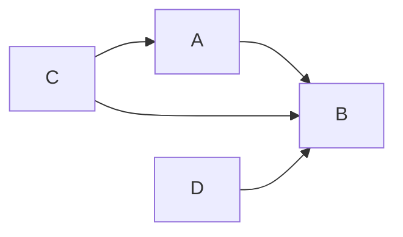
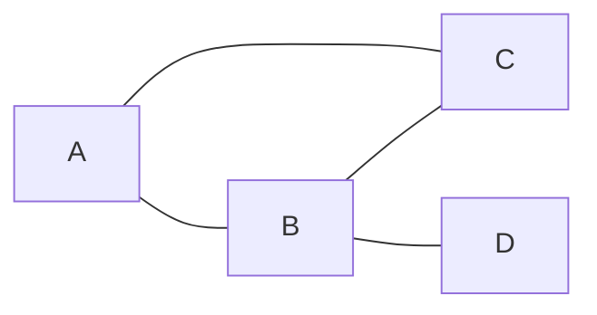
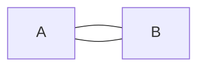
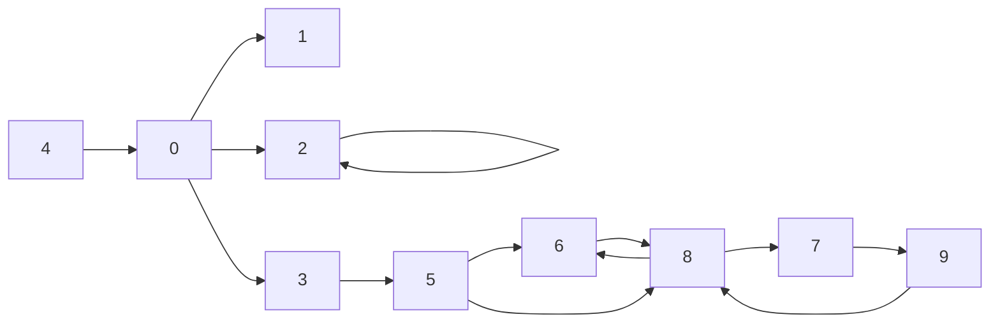

# Graph Theory
- Set
	- Nodes (V: Vertix)
	- Edges (Connections)
- Tuple of 2 sets
	- G(V, E)
		- V: set of nodes
		- E: set of edges
- Graph
	- Directed graph
		- G = (V, E)
		- Edges had direction
	- Undirected graph
		- G = {V, E}
		- (A) <-> (B) ~ (A) - (B)


G = (V, E)
V = {A, B, C, D}
E = {(A,B), (D,B), (C,A), (C,B)}
A: Starting point
B: Ending point


G = {V, E}
V = {A, B, C, D}
E = {(A,B), (D,B), (C,A), (C,B)}

∃ another situation (out of the scopre of oure course)
- multigraph: more than one edge per two nodes


concepts:
- nodes
- edges
- loop: (A,A) & {A,A}
	```mermaid
	graph TD;
	A --> A;
	B --- B;
	```
- adjacent vertex & edge
	- What are the adjents of 
		- Adj A: {B, C}
		- Adj B: {A, C, D}
		- Adj C: {A, B}
		- Adj D: {B}
		```mermaid
		graph LR;
		A --- B;
		B --- C;
		A --- C;
		B --- D;
		```
- outdoing edge & incoming edge
	- outgoing
		- ( . , A)
		- (A, . )
- multi-graphs (don't learn!)


G = (V,E)
V = {0,1,2,3,4,5,6,7,8,9}
E = {(0,1),(0,3),(0,2),(2,2),...}

| .  | : ordinality of a set ( number of element in a set ) 
loops: {2}
In (8): {5,6,9}
Out (8): {6,7}

- How you sort the elements in a set is **not** relevant?


