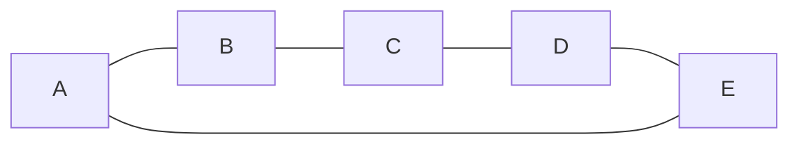
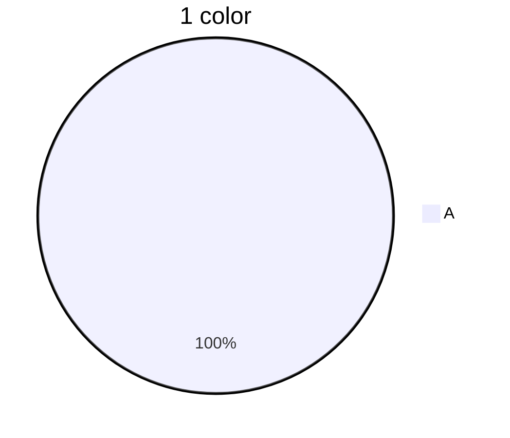
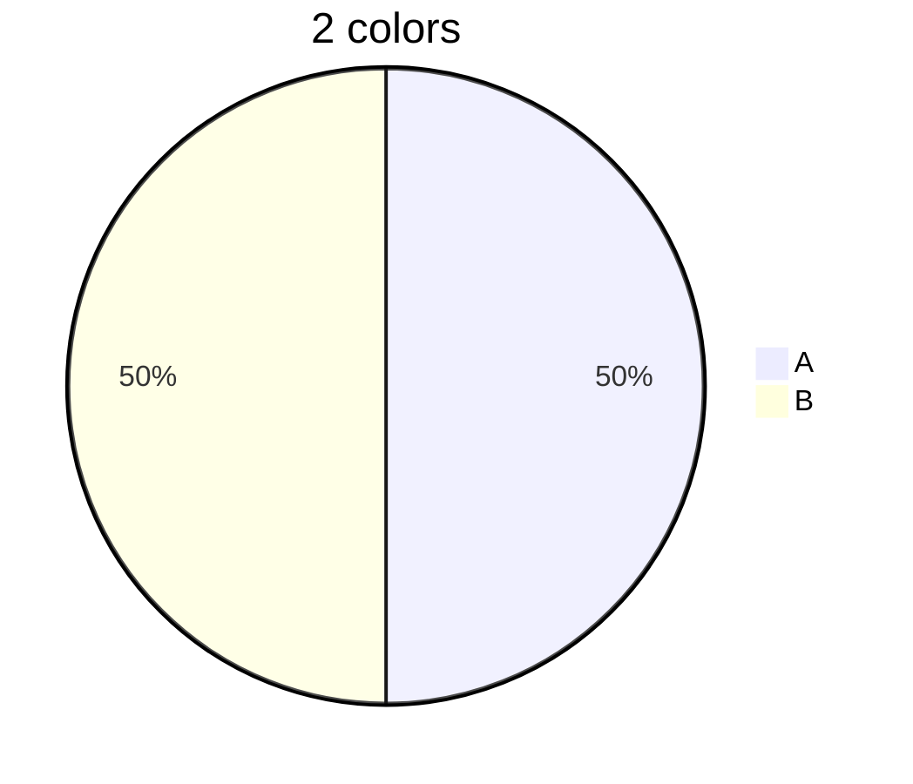
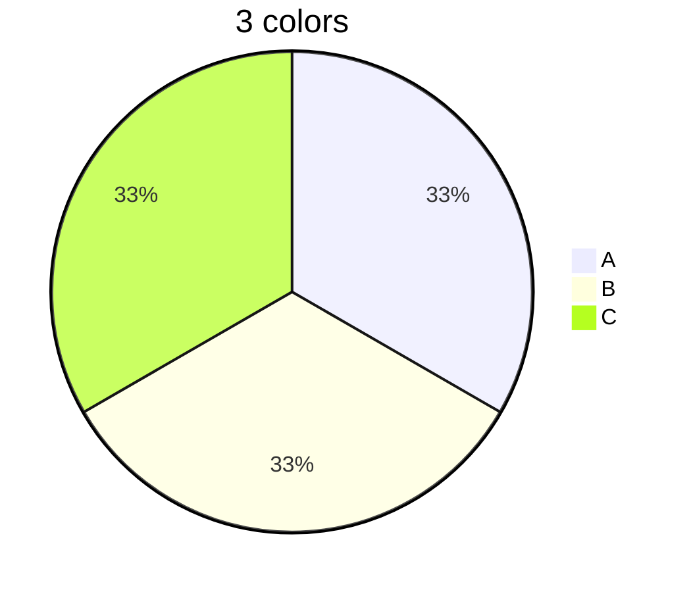
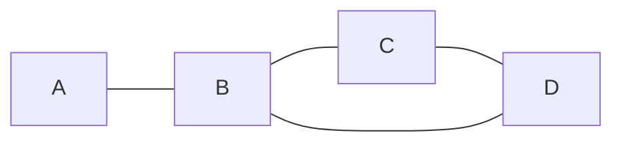
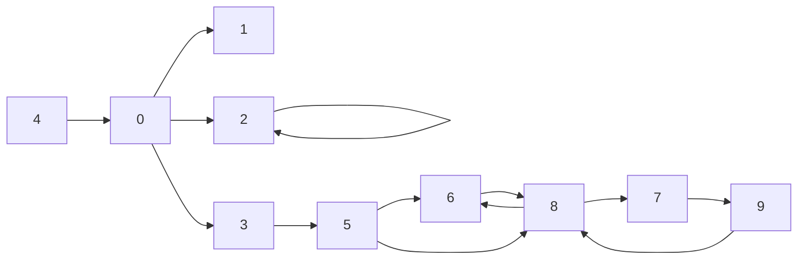
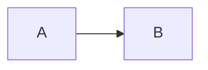

rench from beginning

---
# Graph theory (cont.)
## Ex1
- Graph in regular: property each note has same number of neighbors
- Circuit: with same length

## Ex2
- Isomophism of graph
	- Figure 1 ?= Figure 2
## Ex3: Courloring
- **US MAP** 




- How many colours we need for painting US map?
	- US Map: 50 
- How many colours we need for painting any map?
## Example
### Facebook
### Instagram
### Map of city
### UML diagrams
### Sitemap
### Neural networks

## Graph presentation

Cn = {V, E}
V = {A, B, C, D}
E = {{A.B}, {B,C}, {C,D}, {B.D}}
### Edge list
![[Pasted image 20221101094430.png]]
### Adjacency list
![[Pasted image 20221101093350.png]]
### Adjacency matrix
![[Pasted image 20221101094512.png]]
- If M is symetric *if and only if* G is undirect
- diag(M) = 0 => ∄ loops
### What to use?
- List
	- Cost of ∃ {A,B}
		- O(|v|) (worst case)
	- Cost of inserting 1 edge
		- O(1)
- Matrix
	- Cost of ∃ {A,B}
		- O(1)
	- Cost of inserting 1 edge
		- O(1)
- If G is dense -> Matrix is better
- If G is sparse -> *maybe* lists better
		- ![[Pasted image 20221101095801.png]]
- If using python -> Matrix?
### Rewrittences
- n! fibonanci : Fib 
- Dynamical systems
- Cycles: **C** (*instead of G*)
	- Undirected: Cn (n > 2)
		- |V| = n
		- |e| = n
	- Directed: Cn (n >= 2)
	- How is M in Cn?
- Wheel graph
	- |v| = n+1
	- |e| = 2n
		![[Pasted image 20221101111026.png]]
- Grids graph: *G(m,n)*
	- |v| = m\*n
	- |n| = 2mn - m - n
- Cube graph:
	- $|V| = 2V^{-1}$
	- $|E| = 2E^{-1}+V^{-1}$
## Definition
### Degree
- Directed: number of incident edges to the node
- Undireccted: number of neighbors
- Loop: count twice
- How we compute the degree?
	- If graph hasn't got loops
		- Degree is equal to sum of elements in the row

|      | in  | out |
| ---- | --- | --- |
| d(0) | 1   | 3   |
| d(1) | 1   | 0   |
| d(2) | 2   | 2   |
| d(3) | 1   | 2   |
| d(4) | 2   | 1   |
| d(5) | 1   | 2   |
| d(6) | 2   | 1   |
| d(7) | 1   | 1   |
| d(8) | 3   | 2   |
| d(9) | 1   | 1   |

### Subgraph
G = {V, E}
V = {A, B, C, D}
E = {{A,B}, {B,C}, {B,D}, {C,D}}
$G_1$ is subgraph of G when
	$G_1 = \{V_1, E_1\}$, $V_1 \subset V$, $E_1 \subset E$ 
		-> $E_1$, $V_1$ are coherence forming a graph
- Eg:
	- $V_1 = \{A,B,C,D\}$ and $E_1={{A,C}}$ -> NO
	- $V_1 = V$ and $E_1=\emptyset$ -> YES
	- $V_1 = \emptyset$ and $E_1=E$ -> YES
### Gauss
$$\sum_{i=1}^N \frac{N*(N+1)}{2}$$
Inductive demonstration
- N=0, N=1, N=2
- Hypothesis: N = n
- Thesesis: N = n+1
### Cube
- $Cube_2$ is a subgraph of $Cube_3$
-  $Cube_n$ is a subgraph of $Cube_{n+1}$
### Path graph
![[Pasted image 20221101135711.png]]
- $P_N$ 
	- $|V| = N$
	- $|E| = N-1$
- Edge
	- Connections: Two notes are connected if ∃ a path
- Path: $v_0$, $v_1$, $v_2$, ..., $v_n$
	- or {$v_0$,$v_1$}, {$v_1$,$v_2$}, ..., {$v_{n-1}$,$v_n$}
- Undirect (Symmetric):
	```mermaid
	graph LR;
	A --- B;
	```
- Direct (No symmertric)
### Length
- Is a path
- Is the number of edgeds
	- Examples: How much is the length of largest simple path in $C_n$?
		- ![[Pasted image 20221101140518.png]]
		-> N-1
### Graph in connected
- *iff* ∃ a path among all couple of nodes
	- ![[Pasted image 20221101140759.png]]
#### Directed graph **strongly connected**
![[Pasted image 20221101140844.png]]
#### Undirected graph
- Connection satisfies equivalence (property)
	- reflexive
		- A is connected with A
	- symmetry
		- A is connected with B => B is connected with A
	- transitive
		- A is connected B
		- B is connected C
			=> A is connected C
- By *def*:
	- A is always connected with A -> We don't need loops
### Labeled vs Unlabeled
![[Pasted image 20221101142153.png]]
- How many unlabeled graphs exist with 3 nodes?
	- ![[Pasted image 20221101142436.png]]
- How many labeled graphs exist with 3 nodes?
	- ![[Pasted image 20221101142454.png]]
	- 0 edge: 1 case
	- 1 edge: 3 cases
	- 2 edge: 3 cases
	- 3 edge: 1 case
- How many unlabeled graphs exist with 4 nodes?
	- ![[Pasted image 20221101145215.png]]
- How many unlabeled graphs exist with n nodes?
	- $|v|=n$
	- $|e|=\frac{n*(n-1)}{2}$
### Subgraph
- $V_1 \subseteq V$
- $E_1 \subseteq E$
- It's a graph

> $E_1 = \{\{A,C\}, \{A,B\}\}$
> $V_1=\{A,B\}$

### Component of a graph G
- It's a graph
- It's connected (or it's an isolated node)
- It's the "largest" subgraph component
- Example:
	```mermaid
	graph LR;
	A --> B;
	B --> C;
	C --> A;
	```
	-> 1 components

### Cut vertex (Articulation vertex)
![[Pasted image 20221101155005.png]]
- G\\v
	- v is an *cut vertex* or *cut articulation* of G if the graph G\\v has larger of components than G
- 

### Path existence
- How many cut nodes there are in ...?
	- $C_n$
		- 0 cut node
	- $K_n$
		- 0 cut node
	- $P_n$
		- n-2 cut nodes
	- $W_n$
		- 0 cut node
### Operations
#### Union
- $G_1=\{V_1,E_1\}$
- $G_2=\{V_1,E_2\}$
- $G_1 \bigcup G_2 = \{V_1 \bigcup V_2, E_1 \bigcup E_2\}$
- Eg: 
	- $V_1=\{A,B,C,D\}$
	- $E_1=\{\{A,B\},\{C,D\}\}$
	- $V_2=\{C,D,F\}$
	- $E_2=\{\{C,F\},\{D,F\}\}$
	- $G_1 \bigcup G_2$:
		- $V_1 \bigcup V_2=\{A,B,C,D,F\}$
		- $E_1 \bigcup E_2 = \{\{A,B\},\{C,D\},\{C,F\},\{D,F\}\}$
		```mermaid
		graph TD;
		A --> B;
		C --> D;
		D --> F;
		F --> C;
		```
- Eg2:
	- $C_n \bigcup P_n = C_n$
	- $K_n \bigcup C_n = K_n$

#### Intersection
- $G_1=\{V_1,E_1\}$
- $G_2=\{V_1,E_2\}$
- $G_1 \bigcap G_2 = \{V_1 \bigcap V_2, E_1 \bigcap E_2\}$
- Eg:
	- $V_1=\{A,B,C,D\}$
	- $E_1=\{\{A,B\},\{C,D\}\}$
	- $V_2=\{C,D,F\}$
	- $E_2=\{\{C,F\},\{D,F\}\}$
	- $G_1 \bigcap G_2$:
		- $V_1 \bigcap V_2=\{C,D\}$
- Eg2:
	- $C_n \bigcap P_n = P_n$
	- $K_n \bigcap C_n = C_n$
	- $K_n \bigcap P_n = P_n$

#### Complement
- $G=\{V,E\}$
- $\overline{G}=\{V, \overline{E}\}$
	- $\overline{E}$: Edges that are not in E
- Eg:
	-  $G=\{V,E\}$
	- $\overline{G}=\{V, \overline{E}\}$
	- $|E|+|\overline{E}|=\frac{|V|*(|\overline{V}|-1)}{2}$
- $G \bigcup \overline{G}=K_n$
- $G \bigcap \overline{G}=$ Isolated nodes (E = {})

#### Ring sum
- $G_1 \bigoplus G_2 =(E_1 \setminus E_2) \bigcup (E_2 \setminus E_1)$ 
