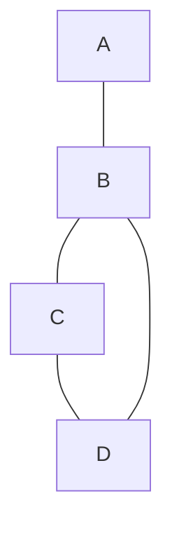
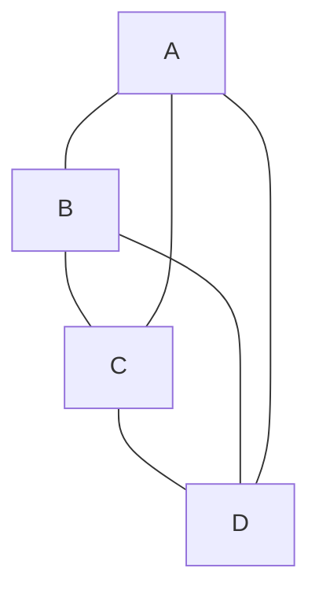
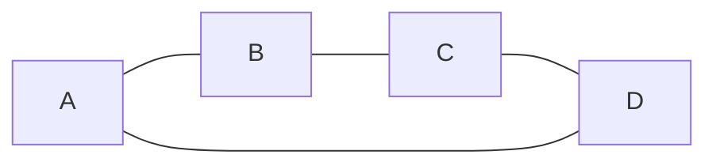

# Graph theory
## Exercises
1. $\sum_{i=1}^6i=1+2+3+4+5+6=21$
2. $\sum_{i=1}^ni=?$ with $n \in N$
	- Particular case:
		- With $n=1$, we have:
			- $\sum_{i=1}^ni=1=\frac{1*(1+1)}{2}$
		-  With $n=2$, we have:
			- $\sum_{i=1}^ni=1+2=3=\frac{2*(2+1)}{2}$
	- We have the general case with $n=k$ (H) $\sum_{i=1}^ni=\frac{n*(n+1)}{2}$
	- We have to prove that this function is corrected with $n=k+1$
		- (T) $\sum_{i=1}^{k+1}i=\frac{(k+1)(k+2)}{2}$
	- Inductive demonstration
		- $\sum_{i=1}^{k+1}i=|\sum_{i=1}^kk|+k+1$
		- $\sum_{i=1}^{k+1}i=\frac{k*(k+1)}{2}+k+1$
		- $\sum_{i=1}^{k+1}i=\frac{k*(k+1)}{2}+\frac{2*(k+1)}{2}$
		- $\sum_{i=1}^{k+1}i=\frac{(k+1)(k+2)}{2}$
			=> Proof
3. Could you please demonstrate that solution is correct?
4. $\sum_{i=0}^n2^{i}=?$ 
	- First way:
		- $\sum_{i=0}^n2^{i}=1+2+4+...+2^n$
		- $2*\sum_{i=0}^n2^{i}=2+4+8+...+2^{n+1}$
		- $2*\sum_{i=0}^n2^{i}-\sum_{i=0}^n2^{i}=2^{n+1}-1$
	- Second way:
		- Particular case:
			- With $n=0$, we have:
				- $\sum_{i=0}^n2^{i}=1=2^{0+1}-1$
			-  With $n=1$, we have:
				- $\sum_{i=0}^n2^{i}=2^0+2^1=3=2^2-1$
		- We have the general case $n=k$ (H) $\sum_{i=0}^k2^{i}=2^{k+1}-1$
		- We have to prove that this function is corrected with $n=k+1$
			- (T) $\sum_{i=0}^{k+1}2^{i}=2^{k+2}-1$
		- Inductive demonstration
			- $\sum_{i=0}^{k+1}2^{i}=|\sum_{i=0}^k2^{i}|+2^k$
			- $\sum_{i=0}^{k+1}2^{i}=2^{k+1}-1+2^k$
			- $\sum_{i=0}^{k+1}2^{i}=2^{k+1+1}-1=2^{k+2}-1$
				=> Proof
5. $\sum_{i=0}^ni^{2}=?$ 
	 - Particular case:
		- With $n=1$, we have:
			- $\sum_{i=0}^ni^{2}=1=\frac{1*(1+1)*(2*1+1)}{6}$
		-  With $n=2$, we have:
			- $\sum_{i=0}^ni^{2}=2^2=4=\frac{2*(2+1)*(2*2+1)}{6}$
	- We have the general case $n=k$ (H) $\sum_{i=0}^ki^{2}=\frac{k*(k+1)*(2k+1)}{6}$
	- We have to prove that this function is corrected with $n=k+1$
		- (T) $\sum_{i=0}^{k+1}i^{2}=\frac{(k+1)*(k+2)*[2*(k+1)+1]}{6}$
	- Inductive demonstration
		- $\sum_{i=0}^{k+1}i^{2}=|\sum_{i=0}^{k}i^{2}|+(k+1)^{2}$
		- $\sum_{i=0}^{k+1}i^{2}=\frac{k*(k+1)*(2k+1)}{6}+(k+1)^{2}$
		- $\sum_{i=0}^{k+1}i^{2}=\frac{k*(k+1)*(2k+1)+6*(k+1)^{2}}{6}$
		- $\sum_{i=0}^{k+1}i^{2}=\frac{(k+1)*(2k^2+k)+(k+1)*(6k+6)}{6}$
		- $\sum_{i=0}^{k+1}i^{2}=\frac{(k+1)*(2k^2+4k+3k+6)}{6}$
		- $\sum_{i=0}^{k+1}i^{2}=\frac{(k+1)*(2k(k+2)+3(k+2))}{6}$
		- $\sum_{i=0}^{k+1}i^{2}=\frac{(k+1)*(k+2)*(2k+3)}{6}$
		- $\sum_{i=0}^{k+1}i^{2}=\frac{(k+1)*(k+2)*[2*(k+1)+1]}{6}$
			=> Proof
	
### Calculus vs. Graph
| Calculus                        | Graph                                                             |
| ------------------------------- | ----------------------------------------------------------------- |
| i is a Natural number           | $G=\{V,E\}$                                                       |
| Particular case (i=0, i=1, i=2) | induction over number of nodes vs. induction over number of edges |
|                                 | G with 1 node vs G with 1 edge                                    |
|                                 | G with 2 nodes vs G with 2 edges                                  |
|                                 | ...                                                               |
| (H) Hypothesis                  | (H)                                                               |
| (T) Thesis                      | (T)                                                               |
## Induction
- Property $P_{(Gr)}$
	- Particular case: $P_{(Gr1)}$, $P_{(Gr2)}$, ... 
	- Hypothesis (H): $P_{(Gr_{k})}$ -> Thesis (T): $P_{(Gr_{k+1})}$ 
	- *Good way* to proof:
		```mermaid
		graph LR;
		id1[Loose graph]
		id2[Small graph that you know that satisfy]
		id1--- |Transf </br> Put out 1 edge to proove|id2
		```
- Example:
	- Tree is a graph without cycles
	- A tree with n nodes has $(n-1)$ edges
		- $T=\{V,E\}$
			- $|E|=|V|-1$
	- Particular case
		- $n=1$
			```mermaid
			graph TD;
			id1[.]
			```
			- $|E|=0$, is a tree
		- $n=2$
			```mermaid
			graph LR;
			id1[.];
			id2[.];
			id1 --- id2;
			```
			- $|E|=1$, is a tree
		- $n=3$
			```mermaid
			graph LR;
			id1[.];
			id2[.];
			id3[.];
			id1 --- id2;
			id2 --- id3;
			```
			- $|E|=2$, is a tree
		- $n=4$, For all cases we have $|E|=3$
		- $(H)$ : A tree with $n$ nodes has $n-1$ edges
		- $(T)$ : A tree with $n+1$ nodes has $n$ edges
			```mermaid
			graph TD;
			id1[.];
			id2[.];
			id3[.];
			id4[.];
			id5[.];
			id6[.];
			id7[.];
			id8[.];
			id1 --- id2;
			id1 --- id3;
			id2 --- id4;
			id2 --- id5;
			id3 --- id6;
			id3 --- id7;
			id7 --- id8;
			```
			*if we put out 1 edge*
			```mermaid
			graph TD;
			id1[.];
			id2[.];
			id3[.];
			id4[.];
			id5[.];
			id6[.];
			id7[.];
			id8[.];
			id1 --- id3;
			id1 -.- id2;
			id2 --- id4;
			id2 --- id5;
			id3 --- id6;
			id3 --- id7;
			id7 --- id8;
			```
			
		- https://youtu.be/_Hbq_dV8enw
	- Note:
		- If you select any edge for putting out -> maybe you don't have anymore a tree
		- What type of edge can we select?
			- You can put out any node with degree 1
	- Let's be $T$ a tree with $n+1$ nodes, if we put out a node with degree 1 we obtain $T'$ with $n$ nodes
		- We know that a tree with $n$ nodes has $n-1$ edges (hypothesis)
			-> $T'$ has $n-1$ edges
			-> $T$ has $n-1$ edges $+1$ (The edge that we put out)
		  Always exists a node with degree 1 in a tree with 2 or more nodes
## Degree
### First case

- $d(A)=1$
- $d(B)=3$
- $d(C)=2$
- $d(D)=2$

### $K_4$

-  $d(A)=d(B)=d(C)=d(D)=3$
- $\sum_{i \in v} i = 12$

### $C_4$


-  $d(A)=d(B)=d(C)=d(D)=2$
- $\sum_{i \in v} i = 8$

$K_4$ & $C_4$ are regular graph


### Dot case
  $d(A)=d(B)=1$
- $\sum_{i \in v} i = 2$

### Property
- **Always** the sum is even
	- *Is this a general property?*
- *Property*:
	- Given $G=\{V,E\}$
		- Proof: $\sum_{i \in V} d(i)$ is in *even*
	- Particular cases:
		- With $|V|=1$, we have:
			- **(.)**
			- $|E|=0$
		- With $|V|=2$, we have: 
			- **(.)---(.)**
			- $|E|=1$
			- $d(A)+d(B)=2$ 
		- With $|V|=3$, we have:
			- **(.)---(.)---(.)**
			- $|E|=4$
			- $d(A)+d(B)+d(C)=4$
	- We have the general case (H) given
		- $G=\{V,E\}$
		- $|V|=k$ 
		- $\sum_{i \in V} d(i)$ is in even
	- We have to prove that this function is corrected with 
		- $G'=\{V',E'\}$
		- $|V'|=n+1$
	- Inductive demonstration
		- Given the total number of degree in the general case is $\sum_{i \in V} d(i)$
		- With a new vertex, we have the number of *new possible degree* of this new vertex which can connect to other vertex $|div_{new}|$
		- We have:
			- $\sum_{i \in V} d(i)$ is even
			- $|div_{new}|$ is even because with every new edge connect to the new vertex, the number of $div$ is even
			- The total number of degree in the (T) case is
				- $\sum_{i \in V'} d(i)=\sum_{i \in V} d(i)+|div_{new}|$
