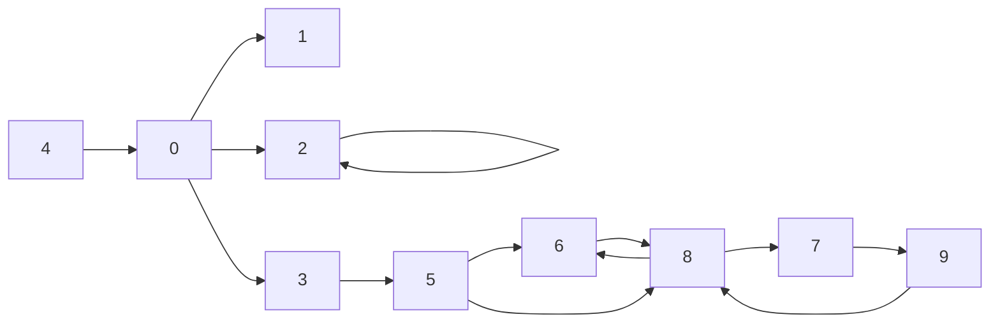
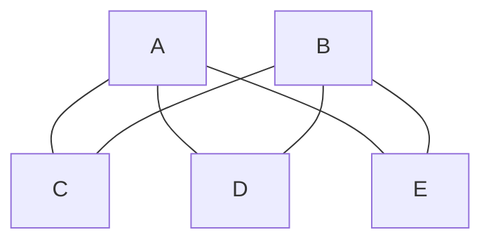

# Graph Theory
## Regular Graph
- [Wolfram | Mathworld](https://mathworld.wolfram.com/RegularGraph.html)
- G is regular *iff* $$d(v)=d(w) \forall v,w \in V$$
	(All nodes have same degree)
- Examples of regular graph with
	- Degree 2: $C_n$
		```mermaid
		graph LR;
		id1[(.)];
		id2[(.)];
		id3[(.)];
		id4[(.)];
		id1 --- id2;
		id2 --- id3;
		id3 --- id4;
		id4--- |...|id1;
		```
	- Degree 3
		- $K_4$
			```mermaid
			graph LR;
			id1[(.)];
			id2[(.)];
			id3[(.)];
			id4[(.)];
			id1 --- id2;
			id2 --- id3;
			id3 --- id4;
			id4 --- id1;
			id1 --- id3;
			id4 --- id2;
			```
		- 
	- Degree 4: ...
## Components graphs
- ∃ path between $\>\mu,V \quad \forall \mu,V$ in the components

- Find all the strongly connected components
	- $C_1:\{1\}$
	- $C_2:\{0,2,4,3\}$
	- $C_3:\{7,9,8,6\}$
## EULER properties in Graphs
### Euler circuit:
- Give $G=\{V,E\}$, we say that a path $v_0,v_1,...,v_n$ is an *Euler circuit* if it satisfies each of the following properties:
	- $v_0=v_n$ (first is the same that the last one)
	- every edge of the graph occurs in the path
	- No edge in this path is repeated
	- Every vertex of G occurs in the path
- Notes:
	- The definition doesn't prohibit the same vertex occuring in an Euler circuit more than once
	- All graph that has an Euler circuit must be connected
	- The length of an Euler circuit is equal to the number of edges of the graph
- Bridges problem
	- ![[Pasted image 20221103091311.png|width]]
	- Visit **all** the bridges
	- Not repeat bridges
- Example of Eulerean Graph
	![[Pasted image 20221103092828.png]]

### Euler path
- Euler path in an undirected graph is a simple path in a graph which visits every edge exactly once.
- Remember the problems of the seven bridges (Euler path): An Euler path which starts and ends on the same vertex is an Euler circuit.

### Properties of euler path for graph 
- Kn is eulerrien ?
	-  when n is odd 
- Pn is eulerrien ?
	- **NO**
- Cn is eulerrien ?
	- **Yes**
- Theorem :
	-  A graph is eulerrien <=> every node has even degree

### Hamiltonian circuit
- Definition:
	- start = end
	- vitisng all nodes
	- no repetition of nodes 
- Examples:
	- Cn
	- Kn with n = 4
### CLUB
- definition:
	-  G is a graph with order n > 2,we call graph G a club  if for all pair of distinct vertices u and v not connected by an edge, we have deg(u)+deg(v) >= n 
	-  if G is a club,then G must have a Hamiltonian
- Example 

### Graph bipartie
Graph  Bipartie means it is seperable into two part 
- Definition Kn,m is complete bipartie graph when :
	- All the vertices of Kn,m are - m,-(m-1),...-1,1,2,...n.Thus Kn,m has exactly n + m vertices.(1 node of graph connect to all other nodes of other graph)
- Example 
K2,3


K n,m is eulerian when n and m are even because both deg of n and m of "nguy" is n or m if n and m are even(theorem) => exist a euler circuit

K n,m  :  $|E|=n.m$ $|V|=n+m$


Complement of Kn,m is never eulerrien because it always has two components
Petersen Graph
- Euler : No,because all node have deg = 3
- Regular : yes,all nodes have same deg
Complement Petersen Graph
- Euler:Yes because all nodes have deg = 6 (even)
$|E|=n.m$
Graph G union with Complement of it always equal to a complete graph


### Tree
Graph G without cycles

- *Kn* is a not a tree
- *Cn* is a tree
- *Pn* is a tree 
- *Kn,m* is a tree when n =1

Definition:
-  *Leaf* : a node without children
-  *inferior node* : all other node
- *Path* :x0 , . . . , xm (path length of m) where x0 is an ancestor of xm, and xm is a descendent of x0.
- *Subtree* : Given a node tree x, consider all of the descendants, this determine a subtree
- *Height*: of a node x is the length of the longest path from the node to a leaf. The height of a tree is the height of its root.
- *Level*: is the length of the path from x to the root. The root has level 0.