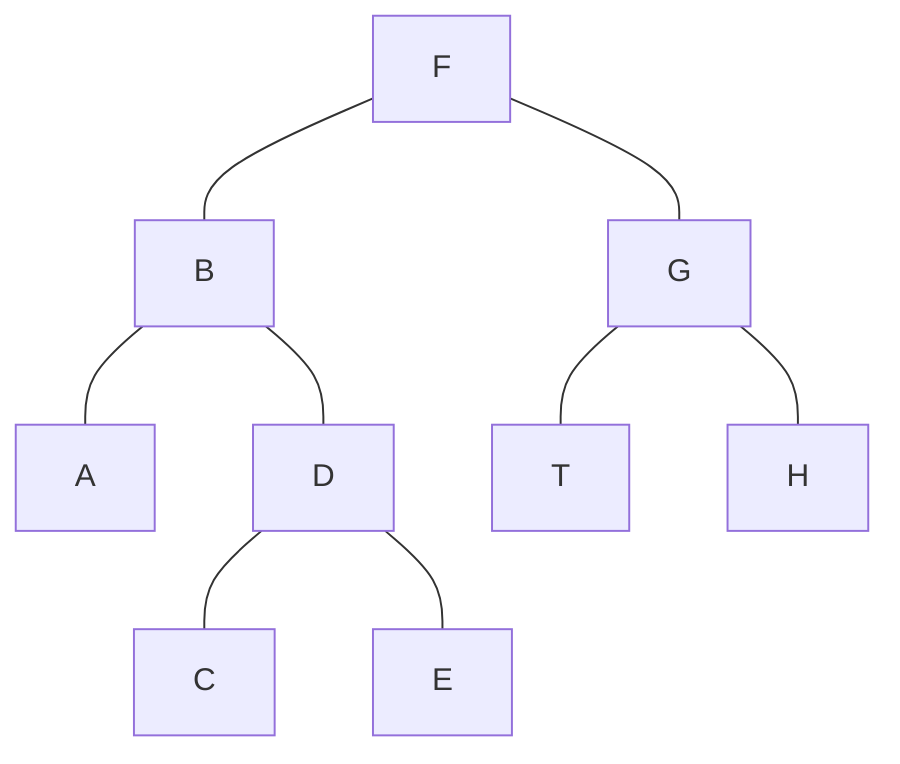
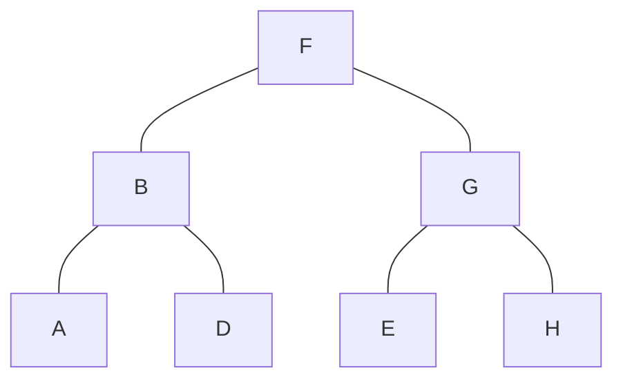
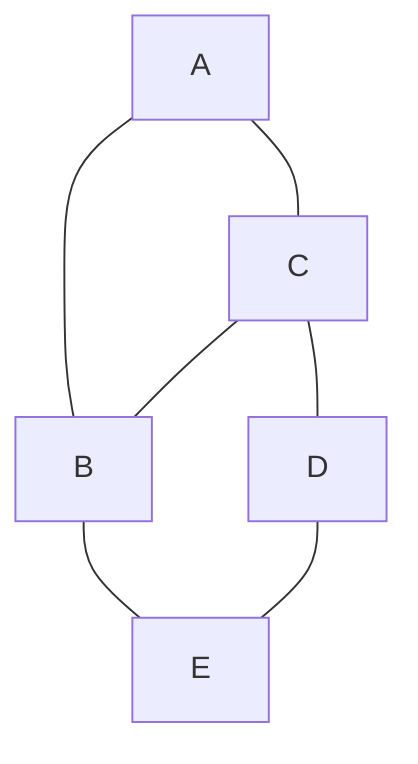

Isomophism in graph 
Two graphs G 1 and G 2 are isomorphic if there is a one-one correspondence between the vertices of G 1 and those of G 2 such that the number of edges joining two vertices of G 1 is equal to the number of edges joining the corresponding vertices of G 2 .

Preorder(T) algorithm 

Orders of tree (Preorder(T) algorithm)
- Print root r 
- let x0,....xn be all the children of the root r,in the left to right order
- while (i <= n)
	- set Ti be the subtree whose root is xi
	- Run Preorder (Ti) if exist children 
	- Increment i
keypoints : 
- left to right 
- print root
- 

Order:  F,B,A,D,C,E,G,T,H

Post-order:
- go from bottom 
example A , C ,E ,D,B,T,H,G,F

In-order binary tree
### Isomophism in graph 
In [graph theory](https://en.wikipedia.org/wiki/Graph_theory "Graph theory"), an **isomorphism of [graphs](https://en.wikipedia.org/wiki/Graph_(discrete_mathematics) "Graph (discrete mathematics)")** _G_ and _H_ is a [bijection](https://en.wikipedia.org/wiki/Bijection "Bijection") between the vertex sets of _G_ and _H_
such that any two vertices _u_ and _v_ of _G_ are [adjacent](https://en.wikipedia.org/wiki/Adjacent_(graph_theory) "Adjacent (graph theory)") in _G_ [if and only if](https://en.wikipedia.org/wiki/If_and_only_if "If and only if") {\displaystyle f(u)} and {\displaystyle f(v)} are adjacent in _H_

### Preorder(T) algorithm 

Orders of tree (Preorder(T) algorithm)
- Print root r 
- let x0,....xn be all the children of the root r,in the left to right order
- while (i <= n)
	- set Ti be the subtree whose root is xi
	- Run Preorder (Ti) if exist children 
	- Increment i
keypoints : 
- left to right 
- print root
- 

Order:  F,B,A,D,C,E,G,T,H

### Post-order:
- go from bottom 
example A , C ,E ,D,B,T,H,G,F

### In-order binary tree

### Preorder(T) algorithm 

Orders of tree (Preorder(T) algorithm)
- Print root r 
- let x0,....xn be all the children of the root r,in the left to right order
- while (i <= n)
	- set Ti be the subtree whose root is xi
	- Run Preorder (Ti) if exist children 
	- Increment i
keypoints : 
- left to right 
- print root
- 

Order:  F,B,A,D,C,E,G,T,H

Post-order:
- go from bottom 
example A , C ,E ,D,B,T,H,G,F

In-order binary tree

A,B,D,F,I,G,H

### Weighted graphs:
A weighted graph G = {V , E } is graph with associated
weights in the edges, we denote the weight of an edge w (e).
A weighted tree T = {G 1 , E 1 } is tree with associated weights
in the edges

### Spanning Tree
Given G = {V,E}

T is spanning tree of Gn
	if T = {V1,E1} with V1 = V and E1 = E and T1 is tree 
### Minimal Spanning Tree
sum of weight is minimal

### How to find the minimal spanning tree
- Prim Algo
- Kruskai Algo

### Prim algorithm
Initialize V1 = {v }, E1 = {}, and set G1 = {V1 , E1 }.
While (exists an edge in E1 that connects a vertex in V 1 to a
vertex not in V 1 )
	Find the minimal w (e) with e = {u, w } such that u ∈ V 1 and w ∈/ V 1 ,
	Set V1 = V  ∪ {w },
	Set E1 = E1 ∪ {e},
	G 1 = (V 1 , E 1 ).
Output G 1 .

Example :

### Kruskal Algo 
T = {V , E 1 }, E 1 = {} (T has n components).
While T has more than one component do
	Find an edge e such that e = {x, y } has the smallest weight, and x and y belongs to distinct components of T .
	Update E 1 = E 1 ∪ {e}.
Output {V , E 1 }.